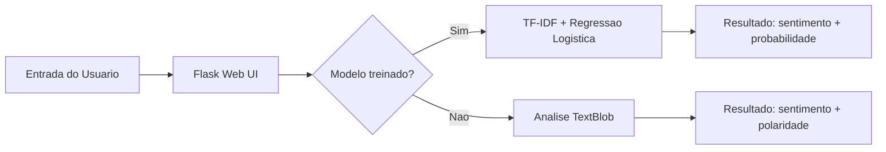
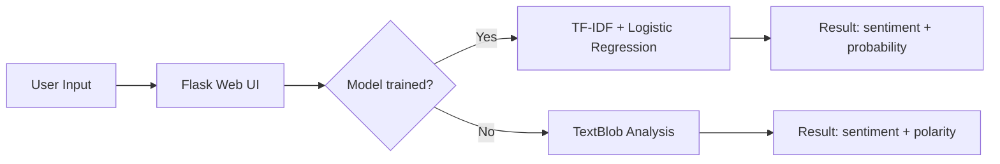

# NLP Sentiment Analyzer

[](https://www.python.org/)
[](https://flask.palletsprojects.com/)
[](https://scikit-learn.org/)
[](https://textblob.readthedocs.io/)
[](https://www.nltk.org/)
[](LICENSE)

[Portugues](#portugues) | [English](#english)

---

## Portugues

### Visao Geral

Aplicacao web em Python/Flask para analise de sentimento de textos em ingles. Oferece dois metodos de analise:

- **TextBlob**: analise rapida baseada em lexico, retorna polaridade (-1 a 1)
- **Modelo customizado**: TF-IDF + Regressao Logistica treinado em dados de exemplo, retorna classificacao com probabilidade

A interface web permite analise de texto individual ou em lote.

### Arquitetura



### Como executar

```bash
# Clonar o repositorio
git clone https://github.com/galafis/NLP-Sentiment-Analyzer.git
cd NLP-Sentiment-Analyzer

# Criar e ativar ambiente virtual
python -m venv venv
source venv/bin/activate  # Windows: venv\Scripts\activate

# Instalar dependencias
pip install -r requirements.txt

# Executar a aplicacao
python sentiment_analyzer.py
```

A aplicacao treina o modelo com dados de exemplo, salva o modelo e inicia o servidor web em `http://localhost:5000`.

### Estrutura do Projeto

```
NLP-Sentiment-Analyzer/
├── tests/
│   ├── __init__.py
│   └── test_main.py
├── sentiment_analyzer.py   # Codigo fonte principal (~360 linhas)
├── requirements.txt
├── LICENSE
└── README.md
```

### Stack Tecnologica

| Tecnologia | Funcao |
|------------|--------|
| Python | Linguagem principal |
| Flask | Servidor web e interface |
| TextBlob | Analise de sentimento por lexico |
| scikit-learn | TF-IDF + Regressao Logistica |
| NLTK | Tokenizacao e stopwords |

### Limitacoes

- Analise apenas em ingles (stopwords em ingles hardcoded)
- Dados de treinamento limitados (10 exemplos)
- Modelo simples (Regressao Logistica linear)

---

## English

### Overview

Python/Flask web application for sentiment analysis of English text. Provides two analysis methods:

- **TextBlob**: fast lexicon-based analysis, returns polarity (-1 to 1)
- **Custom model**: TF-IDF + Logistic Regression trained on sample data, returns classification with probability

The web interface supports single and batch text analysis.

### Architecture



### How to Run

```bash
# Clone the repository
git clone https://github.com/galafis/NLP-Sentiment-Analyzer.git
cd NLP-Sentiment-Analyzer

# Create and activate virtual environment
python -m venv venv
source venv/bin/activate  # Windows: venv\Scripts\activate

# Install dependencies
pip install -r requirements.txt

# Run the application
python sentiment_analyzer.py
```

The application trains the model on sample data, saves it, and starts the web server at `http://localhost:5000`.

### Project Structure

```
NLP-Sentiment-Analyzer/
├── tests/
│   ├── __init__.py
│   └── test_main.py
├── sentiment_analyzer.py   # Main source file (~360 lines)
├── requirements.txt
├── LICENSE
└── README.md
```

### Tech Stack

| Technology | Role |
|------------|------|
| Python | Core language |
| Flask | Web server and UI |
| TextBlob | Lexicon-based sentiment analysis |
| scikit-learn | TF-IDF + Logistic Regression |
| NLTK | Tokenization and stopwords |

### Limitations

- English only (hardcoded English stopwords)
- Limited training data (10 examples)
- Simple model (linear Logistic Regression)

---

### Author

**Gabriel Demetrios Lafis**
- GitHub: [@galafis](https://github.com/galafis)
- LinkedIn: [Gabriel Demetrios Lafis](https://linkedin.com/in/gabriel-demetrios-lafis)

### License

MIT License - see [LICENSE](LICENSE) for details.
